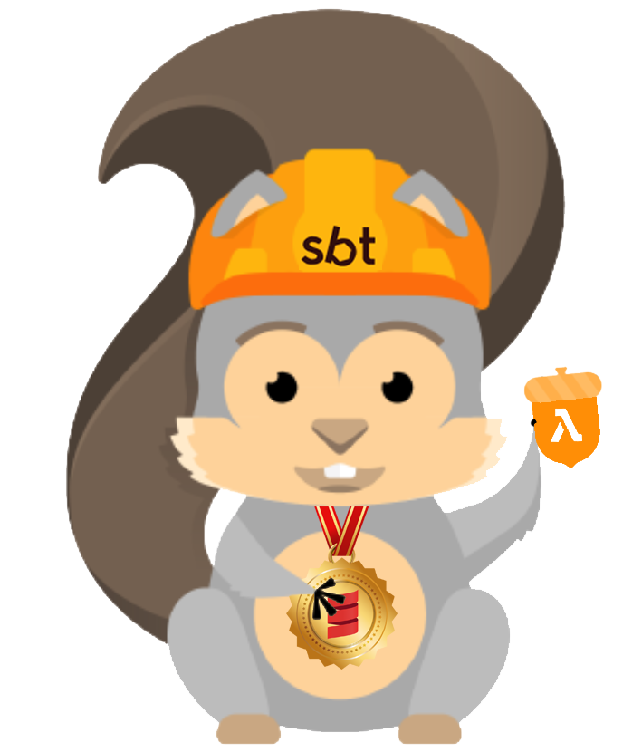

# sbt-serverless-plugin
Work in progress...

## Annotation usage
- Annotationa are used to configure the Lambda Event Handler type for example, the ApiGatewayHandler must be configured to use a specific path, http method and optionally if it is secured or not.

- __@DynamoConf__(tableName = "Person", batchSize = 100, startingPosition = "LATEST", enabled = true); means that the DynamoDBHandler will be configured to use the `logical` table name 'Person', but the runtime projection of the table will become the table name: `$projectName-$stage-$tableName`, it will receive batches of 100 events, starting from the LATEST position. The handler will be automatically enabled when deployed.
- __@ApiGatewayHandler__(path = "/", method = "get", enableAuthorization = true); mean that the lambda will receive events that are received on the path '/orders', with HTTP method 'get' and authorization is enabled.

## Lambda Event Type Handling
Lambdas can only handle one type of event. This means that a Lambda must extend a specialized trait to handle a specific type of event. The supported events are:

- ApiGatewayHandler: handles Api Gateway requests/response events,
- DynamoDbHandler: handles DynamoDB stream events,

## Cognito Configuration
AWS Cognito will be configured globally by means of typesafe configuration that contains the userpool and application id.

## Table Configuraiton
AWS DynamoDB tables will be configured globally by means of typesafe configuration that contains the table name, key configuration, primary and secondary index configurations.

## Kinesis Configuration
AWS Kinesis configuration will be configured globally by means of typesafe configuration that contains the stream name, shard configuration...

## SNS Configuration
AWS SNS configuration will be configured globally by means of typesafe configuration that contains the topic name, if ordering is enabled and ...

## Naming conventions for resources
- Every sbt-sam-project has a `name` (standard-setting),
- Every sbt-sam-project has a `version` (standard-setting),
- Every sbt-sam-project has a `stage` (custom-defined-setting),
- The sbt-sam-project will be deployed with AWS CloudFormation,
- The runtime projection of an `sbt-sam-project` will be a CloudFormation stack, and will be referred as `sam-stack`.
- The CloudFormation stack name will become `$projectName-$stage`
- The AWS Resource Names will be prefixed with: `$projectName-$stage`,

## Design SAM Template Creation
- All class files that extend `com.amazonaws.services.lambda.runtime.RequestStreamHandler` are a Lambda
- All Lambda's that are marked with `com.github.dnvriend.lambda.*` annotations have dependencies with AWS resources
- The indexing process results in a `List[LambdaConfiguration]`,
- The record `LambdaConfiguration` contains:
  - Lambda `File`,
  - Lambda `Class[_]`,
  - LambdaConf, properties like `timeout`, `memory` etc,
  - List of AWS resource dependencies, `com.github.dnvriend.lambda.*` annotations,
- The `List[LambdaConfiguration]` must be folded to an `AWS SAM template` to be deployed,

## sbt-sam-project build knowledge
Because an sbt-sam-project has a runtime projection to a single CloudFormation stack, known as `sam-stack`, when sbt-sam launches, it must get the current sam-stack information, if any, from AWS. This will be known as the `CURRENT-sam-stack`.

The sam-project information will be the configured resources (typesafe configuration) and lambda configuration (annotations) and will be known as the `NEW-sam-stack`.

The `CURRENT-sam-stack` and the `NEW-sam-stack` can be compared, and if there is a difference, the runtime projection of the sbt-sam-project will be updated effectively this means calling CloudFormation and instructing it to deploy and configure resources.

## Deployment process
Lambdas are dependent on AWS resources and therefor these resources must be deployed first before the lambdas can be used. Maybe (????) SAM/CF can be used for this.

## AWS SAM
[AWS Serverless Application Model (SAM)](http://docs.aws.amazon.com/lambda/latest/dg/deploying-lambda-apps.html) extends AWS CloudFormation to provide a simplified way of defining the Amazon API Gateway APIs, AWS Lambda functions, and Amazon DynamoDB tables needed by your serverless application.

You can use AWS CloudFormation to specify, deploy, and configure serverless applications. AWS CloudFormation is a service that helps you model and set up your AWS resources so that you can spend less time managing those resources and more time focusing on your applications that run in AWS.

The AWS Serverless Application Model (AWS SAM) is a model to define serverless applications. AWS SAM is natively supported by AWS CloudFormation and defines simplified syntax for expressing serverless resources. The specification currently covers APIs, Lambda functions and Amazon DynamoDB tables.

## AWS SAM Open Source
The goal of [AWS SAM](https://github.com/awslabs/serverless-application-model) is to define a standard application model for serverless applications.

## Packaging
Packaging can be either a .zip with all code/dependencies or a standalone (uber) .jar file. Compiled classes & resource files at the root-level, required jars in the /lib directory.

## AWS CodeBuild
Fully managed build service that compiles source code, runs tests and produces software packages. You can provide custom build environment, tailored to your needs using Docker images. AWS CodeBuild has integrations with CodePipeline. CodeBuild can be used as a "Test" action in CodePipeline.

## Builds
Definitions:
- Continuous integration: Source -> Build (after each commit)
- Continuous delivery: Source -> Build -> Integration Test (Blocks not to go to production automatically)
- Continuous deployment: Source -> Build -> Integration Test -> Production (automatically)

These models are all supported by CodePipeline.

## Videos
- [AWS - Building a Development Workflow for Serverless Applications (March - 2017)](https://www.youtube.com/watch?v=e3lreqpWN0A)
- [AWS - Local Testing and Deployment Best Practices for Serverless Applications](https://www.youtube.com/watch?v=QRSc1dL-I4U)
- [AWS - Security Best Practices for Serverless Applications - 2017 AWS Online Tech Talks](https://www.youtube.com/watch?v=AV24RTvbgWA)
- [AWS - Serverless Orchestration with AWS Step Functions](https://www.youtube.com/watch?v=8rmgF-SbcIk)
- [AWS -  Serverless Architectural Patterns and Best Practices](https://www.youtube.com/watch?v=b7UMoc1iUYw)
- [AWS - Optimizing the Data Tier for Serverless Web Applications](https://www.youtube.com/watch?v=BG_xi6ACm5I)
