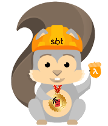

# sbt-sam
[](https://travis-ci.org/dnvriend/sbt-sam)
[](https://www.codacy.com/app/dnvriend/sbt-sam?utm_source=github.com&amp;utm_medium=referral&amp;utm_content=dnvriend/sbt-sam&amp;utm_campaign=Badge_Grade)
[](https://codecov.io/gh/dnvriend/sbt-sam)
[](https://bintray.com/dnvriend/maven/sam-lambda/_latestVersion)
[](http://www.apache.org/licenses/LICENSE-2.0.txt)

## Notice
`sbt-sam` is work in progress so the best way to enjoy `sbt-sam` - in the mean-time - is cloning the project and publish the artifacts
locally in order to have the latest artifacts. Then take a look at the seed projects, update the `sbt-sam`'s library versions
according to your latest build and enjoy the same workflow you're used to, but for creating serverless applications!

We do our best to create a first base version that supports `cognito` user pool secured `api gateway` backend components that
support `dynamodb`, `dynamodb streams`, `kinesis`, `sns` and `s3`. 

```bash
$ git clone git@github.com:dnvriend/sbt-sam.git
cd sbt-sam
sbt compile publishLocal
``` 

## Installation
`sbt-sam` comes in the form of an sbt-plugin and libraries, and is published to [Bintray jcenter](https://bintray.com/bintray/jcenter) 
so you should edit at least two files. The latest version is [](https://bintray.com/dnvriend/maven/sam-lambda/_latestVersion)

**Installation of the libraries**:
Add the following to your `build.sbt` file:

```
libraryDependencies += "com.github.dnvriend" %% "sam-annotations" % "put-latest-version-here"
libraryDependencies += "com.github.dnvriend" %% "sam-lambda" % "put-latest-version-here"
```

**Installation of the sbt-plugin**:
Add the following to your `project/plugins.sbt` file:

```
addSbtPlugin("com.github.dnvriend" % "sbt-sam-plugin" % "put-latest-version-here")

resolvers += Resolver.url("bintray-dnvriend-ivy-sbt-plugins", url("http://dl.bintray.com/dnvriend/sbt-plugins"))(Resolver.ivyStylePatterns)
resolvers += Resolver.bintrayRepo("dnvriend", "maven") 
```

## sbt-sam seed projects
The following seed projects are available:

- [dnvriend/sam-seed.g8](https://github.com/dnvriend/sam-seed.g8): A template for creating public accessible, stateless applications
- [dnvriend/sam-scheduled-event-seed.g8](https://github.com/dnvriend/sam-scheduled-event-seed.g8): A template project for quickly creating schedule driven serverless applications 
- [dnvriend/sam-dynamodb-seed.g8](https://github.com/dnvriend/sam-dynamodb-seed.g8): A template for quickly creating stateful serverless applications using [dynamodb](http://docs.aws.amazon.com/amazondynamodb/latest/developerguide/Introduction.html)
- [dnvriend/sam-dynamodb-scanamo-seed.g8](https://github.com/dnvriend/sam-dynamodb-scanamo-seed.g8): A template for quickly creating stateful serverless applications using dynamodb and [scanamo](https://github.com/scanamo/scanamo)
- [dnvriend/sam-dynamodb-streams-seed.g8](https://github.com/dnvriend/sam-dynamodb-streams-seed.g8): A template project for quickly creating stateful serverless applications using [dynamodb streams](http://docs.aws.amazon.com/amazondynamodb/latest/developerguide/Streams.html)
- [dnvriend/sam-sns-seed.g8](https://github.com/dnvriend/sam-sns-seed.g8): A template project for quickly creating applications driven by [sns](https://aws.amazon.com/sns/) async notifications
- [dnvriend/sam-kinesis-seed.g8](https://github.com/dnvriend/sam-kinesis-seed.g8): A template project for quickly creating applications that produce data for analytics or data processing.
- [dnvriend/sam-data-segment-seed.g8](https://github.com/dnvriend/sam-data-segment-seed.g8): A template project for quickly creating a serverless data-segment leveraging [Kappa Architecture](http://milinda.pathirage.org/kappa-architecture.com/).
- [dnvriend/sam-schema-repo-seed.g8](https://github.com/dnvriend/sam-schema-repo-seed.g8): A template project for quickly creating a serverless avro schema repository.
- [dnvriend/sam-microservice-seed.g8](https://github.com/dnvriend/sam-microservice-seed.g8): A template project for quickly creating serverless event-sourced, dynamodb event-store backed applications.
- [dnvriend/sam-schema-definition-seed.g8](https://github.com/dnvriend/sam-schema-definition-seed.g8): A template project for quickly creating schema definition projects..
- [dnvriend/sam-authorization-seed.g8](https://github.com/dnvriend/sam-authorization-seed.g8): A template project for quickly creating a serverless authentication and authorization service.
- [dnvriend/sam-akka-stream-seed.g8](https://github.com/dnvriend/sam-akka-stream-seed.g8): A template project for creating serverless components with akka-stream.
- [dnvriend/sam-s3-seed.g8](https://github.com/dnvriend/sam-s3-seed.g8): A template project for quickly creating S3 bucket event handlers.
- [dnvriend/sam-cloudwatch-seed.g8](https://github.com/dnvriend/sam-cloudwatch-seed.g8): A template project for quickly creating CloudWatch event handlers.
- [dnvriend/sam-rds-vpc-seed.g8](https://github.com/dnvriend/sam-rds-vpc-seed.g8): A template project for quickly creating a sam connecting to RDS via a VPC.
                                                                                         
## Mini Data and Analytics Platform
- [sam-mini-platform](https://github.com/dnvriend/sam-mini-platform): A mini platform for ingesting, processing, and analyzing data.

## sbt-sam test projects
- [sam-encryption-test](sam-encryption-test): A small study project on AWS encryption using AWS KMS, AWS Lambda and sbt-sam.

## Available tasks
The following tasks are available:

### samInfo
The task `samInfo` shows the current state of the component. In future versions, the task will also show the differences between 
the component as defined by the project, and the current `projection` of the component in AWS:

When there is no projection:

```bash
> samInfo
[info] ====================
[info] Stack State:
[info] ====================
[info] Stack 'sam-dynamodb-streams-seed-dendev' is not yet deployed
[info] Lambdas:
[info] Api Http Event Handlers:
[info] * GetPerson: not yet deployed
[info] * PostPerson: not yet deployed
[info] * GetPersonIds: not yet deployed
[info] * GetListOfPerson: not yet deployed
[info] DynamoDB Streams Handlers:
[info] No DynamoDB event handlers configured
[info] Scheduled Event Handlers:
[info] No scheduled event handlers configured
[info] Kinesis Event Handlers:
[info] No kinesis event handlers configured
[info] SNS Event Handlers:
[info] No SNS event handlers configured
[info] DynamoDbTables:
[info] * people_ids: not yet deployed
[info] * people: not yet deployed
[info] SNS Topics:
[info] No topics configured
[info] Kinesis Streams:
[info] No streams configured
[info] Endpoints:
[info] No service endpoint found
[success] Total time: 15 s, completed Dec 25, 2017 9:50:04 AM
```

When there is a projection:

```bash
> samInfo
[info]
[info] ====================
[info] Stack State:
[info] ====================
[info] Name: sam-dynamodb-streams-seed-dendev
[info] Description: No description
[info] Status: UPDATE_COMPLETE
[info] Status reason: No status reason
[info] Last updated: Mon Dec 25 09:51:15 CET 2017
[info] ServiceEndpoint: https://83s0mdgwve.execute-api.eu-west-1.amazonaws.com/dendev
[info] Lambdas:
[info] Api Http Event Handlers:
[info] * PostPerson:
[info]   - Arn: arn:aws:lambda:eu-west-1:123456789:function:sam-dynamodb-streams-seed-dendev-PostPerson-1MHJFKIRG9R3E
[info]   - Role: arn:aws:iam::123456789:role/sam-dynamodb-streams-seed-dendev-PostPersonRole-O3MLQ6A02WK1
[info]   - Handler: com.github.dnvriend.PostPerson::handleRequest
[info]   - size: 52396083
[info]   - timeout: 300
[info]   - memory: 1024
[info]   - tracing: Active
[info]   - lastmodified: 2017-12-25T08:51:44.641+0000
[info] * GetPerson:
[info]   - Arn: arn:aws:lambda:eu-west-1:123456789:function:sam-dynamodb-streams-seed-dendev-GetPersonIds-1UFSUY7OHO88E
[info]   - Role: arn:aws:iam::123456789:role/sam-dynamodb-streams-seed-dendev-GetPersonIdsRole-1PNBZRCMTUJGU
[info]   - Handler: com.github.dnvriend.GetPersonIds::handleRequest
[info]   - size: 52396083
[info]   - timeout: 300
[info]   - memory: 1024
[info]   - tracing: Active
[info]   - lastmodified: 2017-12-25T08:51:36.510+0000
[info] DynamoDB Streams Handlers:
[info] No DynamoDB event handlers configured
[info] Scheduled Event Handlers:
[info] No scheduled event handlers configured
[info] Kinesis Event Handlers:
[info] No kinesis event handlers configured
[info] SNS Event Handlers:
[info] No SNS event handlers configured
[info] DynamoDbTables:
[info] * people:
[info]   - TableName: sam-dynamodb-streams-seed-dendev-people
[info]   - TableId: 69fc4efe-ebe6-4094-90a8-af014ecf5737
[info]   - TableArn: arn:aws:dynamodb:eu-west-1:123456789:table/sam-dynamodb-streams-seed-dendev-people
[info]   - Table status: ACTIVE
[info]   - Number of items: 0
[info]   - TableSizeBytes: 0
[info]   - TableCreation: Mon Dec 25 09:51:19 CET 2017
[info]   - ProvisionedThroughput: {NumberOfDecreasesToday: 0,ReadCapacityUnits: 1,WriteCapacityUnits: 1}
[info]   - KeySchema: [{AttributeName: id,KeyType: HASH}]
[info]   - Attribute Definitions: [{AttributeName: id,AttributeType: S}]
[info]   - Local Secondary Indexes: null
[info]   - Global Secondary Indexes: null
[info]   - StreamArn: arn:aws:dynamodb:eu-west-1:123456789:table/sam-dynamodb-streams-seed-dendev-people/stream/2017-12-25T08:51:19.399
[info]   - StreamLabel: 2017-12-25T08:51:19.399
[info]   - Restore Summary: null
[info] SNS Topics:
[info] No topics configured
[info] Kinesis Streams:
[info] No streams configured
[info] Endpoints:
[info] GET - https://83s0mdgwve.execute-api.eu-west-1.amazonaws.com/dendev/person
[info] POST - https://83s0mdgwve.execute-api.eu-west-1.amazonaws.com/dendev/person
[info] GET - https://83s0mdgwve.execute-api.eu-west-1.amazonaws.com/dendev/person/{id}
[info] GET - https://83s0mdgwve.execute-api.eu-west-1.amazonaws.com/dendev/personids
[success] Total time: 1 s, completed Dec 25, 2017 9:52:35 AM
```

### samDeploy
The task `samDeploy` `deploys/installs` the component to AWS. The `samDeploy` task is also used to `update` a component.
The `samDeploy` task uses a combination of [CloudFormation](https://aws.amazon.com/cloudformation/)
and the [AWS Java SDK](https://aws.amazon.com/sdk-for-java/) in order to control and report about the deployment process and to let
`sbt-sam` get information about the current component and AWS projection:

```bash
> samDeploy
[info] Creating cloud formation stack
[info] CREATE_IN_PROGRESS - AWS::S3::Bucket - SbtSamDeploymentBucket - CREATE_IN_PROGRESS -
[info] CREATE_IN_PROGRESS - AWS::S3::Bucket - SbtSamDeploymentBucket - CREATE_IN_PROGRESS - Resource creation Initiated
[info] CREATE_IN_PROGRESS - AWS::S3::Bucket - SbtSamDeploymentBucket - CREATE_COMPLETE -
[info] CREATE_COMPLETE - AWS::CloudFormation::Stack - sam-seed-hello - CREATE_COMPLETE -
[==================================================]   100%   Lambda JAR -> S3S3
[info] Updating cloud formation stack
[info] Change set status: CREATE_PENDING - execution status: UNAVAILABLE -
[info] Change set status: CREATE_COMPLETE - execution status: AVAILABLE -
[info] Executing change set: 'sam-change-set6e6d5a3b-da00-4bbe-a2b3-46417e0c0ec2'
[info] UPDATE_IN_PROGRESS - AWS::IAM::Role - HelloLambdaRole - CREATE_IN_PROGRESS -
[info] UPDATE_IN_PROGRESS - AWS::IAM::Role - HelloLambdaRole - CREATE_IN_PROGRESS - Resource creation Initiated
[info] UPDATE_IN_PROGRESS - AWS::IAM::Role - HelloLambdaRole - CREATE_COMPLETE -
[info] UPDATE_IN_PROGRESS - AWS::Lambda::Function - HelloLambda - CREATE_IN_PROGRESS -
[info] UPDATE_IN_PROGRESS - AWS::Lambda::Function - HelloLambda - CREATE_IN_PROGRESS - Resource creation Initiated
[info] UPDATE_IN_PROGRESS - AWS::Lambda::Function - HelloLambda - CREATE_COMPLETE -
[info] UPDATE_IN_PROGRESS - AWS::ApiGateway::RestApi - ServerlessRestApi - CREATE_IN_PROGRESS -
[info] UPDATE_IN_PROGRESS - AWS::ApiGateway::RestApi - ServerlessRestApi - CREATE_IN_PROGRESS - Resource creation Initiated
[info] UPDATE_IN_PROGRESS - AWS::ApiGateway::RestApi - ServerlessRestApi - CREATE_COMPLETE -
[info] UPDATE_IN_PROGRESS - AWS::Lambda::Permission - HelloLambdaHelloLambdaPermissionTest - CREATE_IN_PROGRESS - Resource creation Initiated
[info] UPDATE_IN_PROGRESS - AWS::ApiGateway::Deployment - ServerlessRestApiDeploymentad309a696b - CREATE_IN_PROGRESS -
[info] UPDATE_IN_PROGRESS - AWS::Lambda::Permission - HelloLambdaHelloLambdaPermissionhello - CREATE_IN_PROGRESS -
[info] UPDATE_IN_PROGRESS - AWS::Lambda::Permission - HelloLambdaHelloLambdaPermissionTest - CREATE_IN_PROGRESS -
[info] UPDATE_IN_PROGRESS - AWS::Lambda::Permission - HelloLambdaHelloLambdaPermissionhello - CREATE_IN_PROGRESS - Resource creation Initiated
[info] UPDATE_IN_PROGRESS - AWS::ApiGateway::Deployment - ServerlessRestApiDeploymentad309a696b - CREATE_IN_PROGRESS - Resource creation Initiated
[info] UPDATE_IN_PROGRESS - AWS::ApiGateway::Deployment - ServerlessRestApiDeploymentad309a696b - CREATE_COMPLETE -
[info] UPDATE_IN_PROGRESS - AWS::ApiGateway::Stage - ServerlessRestApihelloStage - CREATE_IN_PROGRESS -
[info] UPDATE_IN_PROGRESS - AWS::ApiGateway::Stage - ServerlessRestApihelloStage - CREATE_IN_PROGRESS - Resource creation Initiated
[info] UPDATE_IN_PROGRESS - AWS::ApiGateway::Stage - ServerlessRestApihelloStage - CREATE_COMPLETE -
[info] UPDATE_IN_PROGRESS - AWS::Lambda::Permission - HelloLambdaHelloLambdaPermissionTest - CREATE_COMPLETE -
[info] UPDATE_IN_PROGRESS - AWS::Lambda::Permission - HelloLambdaHelloLambdaPermissionhello - CREATE_COMPLETE -
[info] UPDATE_COMPLETE_CLEANUP_IN_PROGRESS - AWS::CloudFormation::Stack - sam-seed-hello - UPDATE_COMPLETE_CLEANUP_IN_PROGRESS -
[success] Total time: 89 s, completed Dec 24, 2017 1:42:25 PM
```

## samRemove
The task `samRemove` removes the component from AWS. It deletes all artifacts uploaded to S3 and removes SNS topics, Tables,
and the deployment S3 bucket:

```
> samRemove
Deleting artifact version: '5fgiHbqR5Xl2_MUm3RlLC1SXFI7yQkRY'
[info] Deleting cloud formation stack
[info] DELETE_IN_PROGRESS - AWS::Lambda::Permission - HelloLambdaHelloLambdaPermissionTest - DELETE_IN_PROGRESS -
[info] DELETE_IN_PROGRESS - AWS::Lambda::Permission - HelloLambdaHelloLambdaPermissionhello - DELETE_IN_PROGRESS -
[info] DELETE_IN_PROGRESS - AWS::ApiGateway::Stage - ServerlessRestApihelloStage - DELETE_IN_PROGRESS -
[info] DELETE_IN_PROGRESS - AWS::S3::Bucket - SbtSamDeploymentBucket - DELETE_IN_PROGRESS -
[info] DELETE_IN_PROGRESS - AWS::ApiGateway::Stage - ServerlessRestApihelloStage - DELETE_COMPLETE -
[info] DELETE_IN_PROGRESS - AWS::S3::Bucket - SbtSamDeploymentBucket - DELETE_COMPLETE -
[info] DELETE_IN_PROGRESS - AWS::ApiGateway::Deployment - ServerlessRestApiDeploymentad309a696b - DELETE_IN_PROGRESS -
[info] DELETE_IN_PROGRESS - AWS::ApiGateway::Deployment - ServerlessRestApiDeploymentad309a696b - DELETE_COMPLETE -
[info] DELETE_IN_PROGRESS - AWS::Lambda::Permission - HelloLambdaHelloLambdaPermissionhello - DELETE_COMPLETE -
[info] DELETE_IN_PROGRESS - AWS::Lambda::Permission - HelloLambdaHelloLambdaPermissionTest - DELETE_COMPLETE -
[info] DELETE_IN_PROGRESS - AWS::ApiGateway::RestApi - ServerlessRestApi - DELETE_IN_PROGRESS -
[info] DELETE_IN_PROGRESS - AWS::ApiGateway::RestApi - ServerlessRestApi - DELETE_COMPLETE -
[info] DELETE_IN_PROGRESS - AWS::Lambda::Function - HelloLambda - DELETE_IN_PROGRESS -
[info] DELETE_IN_PROGRESS - AWS::Lambda::Function - HelloLambda - DELETE_COMPLETE -
[info] DELETE_IN_PROGRESS - AWS::IAM::Role - HelloLambdaRole - DELETE_IN_PROGRESS -
[info] DELETE_IN_PROGRESS - AWS::IAM::Role - HelloLambdaRole - DELETE_COMPLETE -
[success] Total time: 22 s, completed Dec 24, 2017 1:43:48 PM
```

## samLogs
The task `samLogs` shows the last log output for a selected lambda:

```
> samLogs CreatePerson
[info] 2017-12-25T19:17:00.125 - REPORT RequestId: cc92212d-e99f-11e7-822c-0310ed4e4ed5	Duration: 164.65 ms	Billed Duration: 200 ms 	Memory Size: 1024 MB	Max Memory Used: 151 MB
[info] 2017-12-25T19:17:00.125 - END RequestId: cc92212d-e99f-11e7-822c-0310ed4e4ed5
[info] 2017-12-25T19:17:00.124 - {}
[info] 2017-12-25T19:16:59.958 - START RequestId: cc92212d-e99f-11e7-822c-0310ed4e4ed5 Version: $LATEST
[info] 2017-12-25T19:16:58.344 - REPORT RequestId: c6f81bf6-e99f-11e7-857b-91f7f814692c	Duration: 6097.46 ms	Billed Duration: 6100 ms 	Memory Size: 1024 MB	Max Memory Used: 151 MB
[info] 2017-12-25T19:16:58.344 - END RequestId: c6f81bf6-e99f-11e7-857b-91f7f814692c
[info] 2017-12-25T19:16:58.241 - {}
[info] 2017-12-25T19:16:52.246 - START RequestId: c6f81bf6-e99f-11e7-857b-91f7f814692c Version: $LATEST
[success] Total time: 1 s, completed Dec 25, 2017 7:20:17 PM
```

## Stage Configuration
sbt-sam can be configured to be used when deploying applications by means of Jenkins. sbt-sam looks at environment variables
for configuration. The most important one is the environment variable `SAM_STAGE`, when if set, overrules the `samStage` setting 
in build.sbt. When Jenkins sets the `SAM_STAGE` variable to 'test', then the stage will be test and the naming of the components
will become scoped with 'test'. The `SAM_STAGE` variable content has no special meaning for sbt-sam, other than grouping components
together.

## AWS Configuration
The standard resolution for AWS credentials is:

- Environment Variables,
- Java System Properties,
- The AWS credentials file,
- The AWS shared config file,
- Container credentials,
- Instance profile credentials

The following environment variables can be set in the environment eg. build server to set the profile, region and api keys to use:

- __AWS_PROFILE__ - The aws profile to use
- __AWS_ACCESS_KEY_ID__ - the aws access key to use
- __AWS_SECRET_ACCESS_KEY__ - the aws secret access key to use
- __AWS_REGION__ - the aws region to use

The following Java System Properties can be set:

- __aws.accessKeyId__ - the aws access key to use
- __aws.secretKey__ - the aws secret access key to use
- __aws.region__ - the aws region to use

The 'default credential profiles' file:
- `~/.aws/credentials`
- Place your credentials (API keys here)
- aws_access_key_id
- aws_secret_access_key
- the file can be set with higher restrictions
- AWS clients will only read credential keys here

The 'default cli config' file:
- `~/.aws/config`
- Place to put credentials and other things
- Don't put credentials here, but you could
- Supported settings are:
- aws_access_key_id:  AWS access key
- aws_secret_access_key: AWS secret key
- aws_session_token: AWS session token. A session token is only required if you are using temporary security credentials.
- region: the aws region to use by the client
- output: output format (json, text, or table)

## Videos
- [AWS - Building a Development Workflow for Serverless Applications (March - 2017)](https://www.youtube.com/watch?v=e3lreqpWN0A)
- [AWS - Local Testing and Deployment Best Practices for Serverless Applications](https://www.youtube.com/watch?v=QRSc1dL-I4U)
- [AWS - Security Best Practices for Serverless Applications - 2017 AWS Online Tech Talks](https://www.youtube.com/watch?v=AV24RTvbgWA)
- [AWS - Serverless Orchestration with AWS Step Functions](https://www.youtube.com/watch?v=8rmgF-SbcIk)
- [AWS -  Serverless Architectural Patterns and Best Practices](https://www.youtube.com/watch?v=b7UMoc1iUYw)
- [AWS - Optimizing the Data Tier for Serverless Web Applications](https://www.youtube.com/watch?v=BG_xi6ACm5I)

## Resources
- [Github - AWS SAM](https://github.com/awslabs/serverless-application-model)
- [AWS - Deploying Lambda-based Applications](http://docs.aws.amazon.com/lambda/latest/dg/deploying-lambda-apps.html)
- [AWS - CloudFormation concepts](http://docs.aws.amazon.com/AWSCloudFormation/latest/UserGuide/cfn-whatis-concepts.html#d0e3897)
- http://docs.aws.amazon.com/sdk-for-java/v1/developer-guide/credentials.html
- http://docs.aws.amazon.com/cli/latest/userguide/cli-chap-getting-started.html
- http://docs.aws.amazon.com/sdk-for-java/v1/developer-guide/credentials.html
- http://docs.aws.amazon.com/sdk-for-java/v1/developer-guide/java-dg-region-selection.html
- http://docs.aws.amazon.com/general/latest/gr/aws-sec-cred-types.html#access-keys-and-secret-access-keys
- [Lambda Environment Variables](http://docs.aws.amazon.com/lambda/latest/dg/current-supported-versions.html)

## Changelog

## 1.0.20 (2018-02-02)
- Merged PR #89 'RDS & Lamda VPC Support', thanks [Martijn van de Grift](https://github.com/martijnvdgrift)!
- Changed the deployment bucket name from 'organizationName-projectName-stage' -> 'organizationName-stage-projectName', please note 
  that this update is a breaking change, as sbt-sam looks for the new deployment bucket name to remove all artifacts,
- added [dnvriend/sam-rds-vpc-seed.g8](https://github.com/dnvriend/sam-rds-vpc-seed.g8) seed project,

## 1.0.19 (2018-01-17)
- Merged PR #86 'Added handler for CloudWatch Lambda events', thanks [Martijn van de Grift](https://github.com/martijnvdgrift)!

## 1.0.18 (2018-01-13)
- Support for S3 Event Sources, see [dnvriend/sam-s3-seed.g8](https://github.com/dnvriend/sam-s3-seed.g8) for examples, thanks [Martijn van de Grift](https://github.com/martijnvdgrift)!
- Support for `com.github.dnvriend.sam.akka.stream.KinesisEventProcessor`, an akka streams event processor for Kinesis streams to
  create a 'FromStream map ToStream' style processor using akka stream declarations,
- Support for `com.github.dnvriend.sam.akka.stream.KinesisEventHandler`, an akka stream based Kinesis Event Handler
- Support for `com.github.dnvriend.kinesis.KinesisProducer`, a KinesisProducer component to produce messages to Kinesis. 
- Support for `com.github.dnvriend.sns.TopicProducer`, an SNS TopicProducer component to produce messages to SNS.  
- Support for `com.github.dnvriend.s3.GetS3Object`, for getting access to the data stored in S3 objects.
- Added the `AmazonS3FullAccess` role to lambdas with no policy (role) annotations.

## 1.0.17 (2018-01-11)
- Support for akka-stream, see [dnvriend/sam-akka-stream-seed.g8](https://github.com/dnvriend/sam-akka-stream) for examples.

## 1.0.16 (2018-01-08)
- Release error due to bintray errors
- Configurable managed policies on lambdas by setting annotations; no annotations means default full policies
- Support for importing dynamodb tables with 'import' syntax.
- General bug fixing

## 1.0.15 (2018-01-08)
- Not Released due to bintray errors

## 1.0.14 (2018-01-08)
- Not Released due to bintray errors

## 1.0.13 (2018-01-06)
- Support for 'com.github.dnvriend.service.Aggregate', a DynamoDB backed event sourced service that provides support
  for working with aggregates of any kind, leveraging a [State Monad](http://eed3si9n.com/learning-scalaz/State.html) 
  for sequencing aggregate events and computing a final aggregate state. Events are stored in the event store as 
  polymorphic JSON events. For more information take a look at [dnvriend/sam-microservice-seed.g8](https://github.com/dnvriend/sam-microservice-seed.g8).

## 1.0.12 (2018-01-06)
- Support for 'DynamoDBJsonWithRangeKeyRepository'
- General bug fixing

## 1.0.11 (2018-01-05)
- Import of user pools
- General bug fixing

## 1.0.10 (2018-01-04)
- Support for Kinesis Extended S3 Firehose
- Support for creating data-segments, an element of a data lake leveraging [Kappa Architecture](http://milinda.pathirage.org/kappa-architecture.com/) 

## 1.0.9 (2018-01-02)
- Merged PR #6: Support for creating & authorizing Cognito User Pool Users, thanks [Kevin Kessels](https://github.com/kkessels)!

## 1.0.8 (2018-01-01)
- Support for creating IAM Roles

## 1.0.7 (2017-12-31)
- Merged PR #61 - Added cognito support, thanks [Martijn van de Grift](https://github.com/martijnvdgrift)! 
  - Support for [AWS Cognito](https://aws.amazon.com/cognito/) [user pools](https://docs.aws.amazon.com/cognito/latest/developerguide/cognito-user-identity-pools.html)
  - Support for AWS Cognito Secured API Gateway Endpoints, backed by AWS Lambda  

## 1.0.6 (2017-12-27)
- Support for AWS Encryption SDK
- Two new ApiGatewayHandlers: `JsonApiGatewayHandler` and `JsonDApiGatewayHandler`
- Fix for `samDeploy` that resolved to incorrect cloudformation-create-update flow
- HttpHandlers show handlerName and httpMethod and httpPath when calling `samInfo`

## 1.0.5 (2017-12-26)
- Fix for `samLogs`
  - resolving the correct logGroup and logStream for the function,
  - showing the logs in ascending order, for use with sbt console logging

## 1.0.4 (2017-12-25)
- Support for logging lambda log output with `samLogs`
- Two new repositories: `BinaryRepository` and `JsonRepository`
- Two new ApiGatewayHandlers: `BinaryDynamoRepoApiGatewayHandler` and `JsonDynamoRepoApiGatewayHandler`

## 1.0.3 (2017-12-25)
- Support for Kinesis Resources
- Support for Kinesis Events

## 1.0.2 (2017-12-24)
- Fix for resolving scoped DynamoDB table names

## 1.0.1 (2017-12-24)
- Support for (public/unsecure) API Gateway
- Support for DynamoDB Table Resources
- Support for DynamoDB Streams Events
- Support for SNS Resources
- Support for SNS Events
- Support for Scheduled Events

## 1.0.0 (2017-12-20)
- Initial release at Bintray jcenter